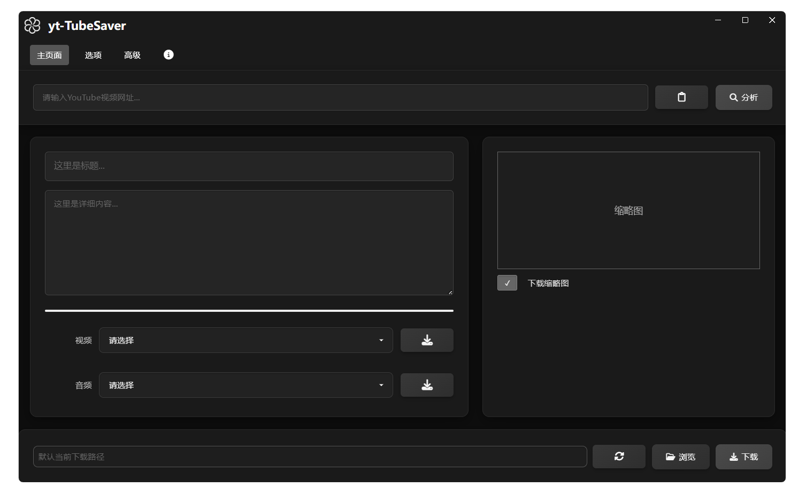

🎥 yt-TubeSaver - YouTube 视频下载工具
================================

> 一个基于 Web 技术的 GUI 工具，使用 HTML/CSS/JavaScript 构建，配合 `yt-dlp` 和 `ffmpeg` 实现 YouTube 视频和音频的下载与转换功能。



* * *

✨ 功能特性
------

*   🎥 支持 cookies 可用性验证
*   🎥 支持 YouTube 视频 URL 解析与下载
*   🔉 支持音频提取及格式转换（MP3/AAC 等）
*   📋 剪贴板 URL 粘贴功能
*   🗂️ 自定义下载路径设置
*   🖼️ 视频缩略图下载选项
*   🎚️ 视频/音频格式选择器（支持 MP4/WebM/MP3/AAC 等）

* * *

📦 文件结构
-------

```
yt-TubeSaver/

├── .history/                    # IDE 自动生成的历史版本文件
├── css/
│   └── style.css                # 主样式表
├── ico
│   ├── favicon.ico              # 网站图标
│   ├── favicon.png              # PNG 格式网站图标
│   └── logo.ico                 # 应用程序 Logo 图标
│
├── images/
│   └── 001.webp                 # 示例图片资源
│
├── js/
│   └── script.js                # 前端逻辑脚本
│
├── main/
│   └── main.js                  # Electron 主进程入口文件
│
├── node_modules                 # Node.js 模块依赖
│
├── .gitignore                   # Git 忽略规则配置文件
├── .gitattributes               # Git 属性配置
├── bfg.jar                      # Git 仓库清理工具
├── ffmpeg.exe                   # 音视频处理工具
├── index.html                   # 主页面 HTML 入口文件
├── package-lock.json            # npm 依赖锁文件
├── package.json                 # 项目元信息和依赖声明
├── preload.js                   # Electron 预加载脚本
├── README.md                    # 项目说明文档
└── yt-dlp.exe                   # YouTube 下载核心工具
```

* * *

🚀 快速开始
-------

### 1\. 下载项目文件

确保项目目录中包含以下两个关键工具：

#### 🔹 `yt-dlp.exe`

前往 releases 页面下载 Windows 版本：

🔗 [https://github.com/yt-dlp/yt-dlp/releases/latest](https://github.com/yt-dlp/yt-dlp/releases/latest)

找到类似文件名：`yt-dlp.exe`  
右键另存为保存到你的项目根目录（如 `D:\youtube`）

#### 🔹 `ffmpeg.exe`

🔗 官方地址：[https://www.gyan.dev/ffmpeg/builds/](https://www.gyan.dev/ffmpeg/builds/)  
这是目前最稳定、更新频繁的 Windows 构建版本。

推荐下载完整包：

🔗 [https://www.gyan.dev/ffmpeg/builds/ffmpeg-release-full.zip](https://www.gyan.dev/ffmpeg/builds/ffmpeg-release-full.zip)

解压后，在 `bin/` 文件夹里找到 `ffmpeg.exe`，复制到你的项目根目录中即可。

* * *

### 2\. 启动应用

运行安装包或下载便携版，解压文件。

* * *

💻 操作界面说明
---------

1.  在选项里选择本地的 cookies 文件，并验证其可用性。
2.  在输入框中粘贴或输入 YouTube 视频 URL。
3.  在主界面粘贴视频链接地址，点击“分析”按钮。
4.  选择所需的视频或音频格式。
5.  （可选）点击“选择路径”按钮设置下载位置。
6.  点击“下载”按钮开始下载。
7.  选择视频分辨率或音频格式后，会自动合并视频与音频。
8.  也可单独下载视频或音频。

* * *

⚙️ 高级选项
-------

*   **视频格式** ：支持 MP4、WebM 等
*   **音频格式** ：支持 MP3、AAC 等
*   **下载路径** ：默认为当前目录

* * *

⚠️ 注意事项
-------

*   必须保留 `ffmpeg.exe` 和 `yt-dlp.exe` 在项目目录中，否则无法正常下载。
*   首次使用可能需要允许运行 `.exe` 文件（Windows 系统安全提示）。
*   某些视频可能受版权保护或地区限制，无法下载。
*   下载速度取决于网络状况。

* * *

🔧 开发状态
-------

✅ **已完成功能**

*   基础 UI 界面
*   URL 输入和解析框架
*   格式选择功能
*   路径设置界面
*   视频下载功能

🛠️ **待实现功能**

*   批量下载功能
*   字幕下载选项

🌟 **未来计划**

*   添加更多视频平台支持（如 Bilibili、Twitter 等）
*   实现下载队列功能
*   增加下载历史记录
*   支持代理设置
*   多语言界面支持（中文/英文/日文等）