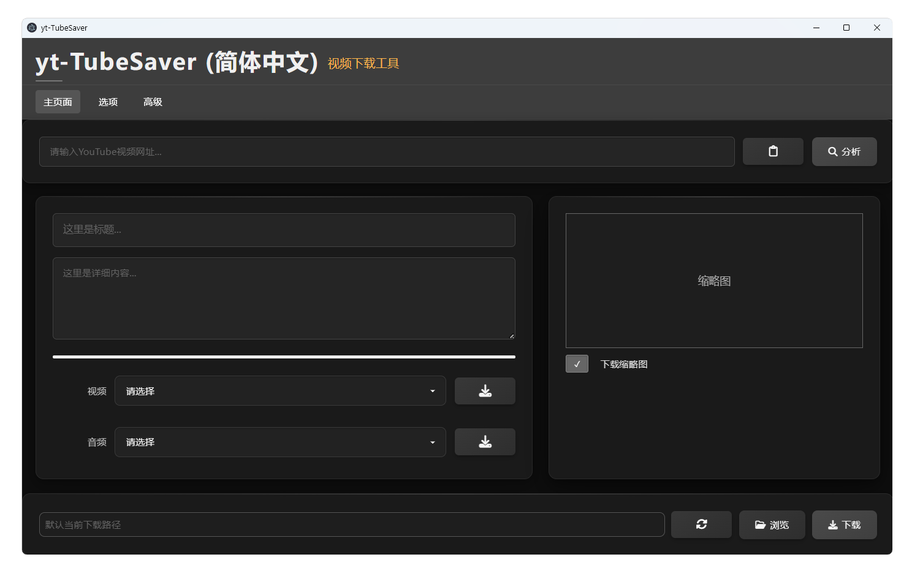

# yt-TubeSaver - YouTube视频下载工具

一个基于Web的YouTube视频下载GUI工具，使用HTML/CSS/JavaScript构建，配合yt-dlp和ffmpeg实现视频下载功能。

## ✨ 功能特性

- 🎥 支持cookies可用性验证
- 🎥 支持YouTube视频URL解析和下载
- 🔉 支持音频提取和格式转换
- 📋 剪贴板URL粘贴功能
- 🗂️ 自定义下载路径设置
- 🖼️ 视频缩略图下载选项
- 🎚️ 视频/音频格式选择

## 📦 文件结构

yt-TubeSaver/
├── .history/               # IDE 自动保存的历史版本文件（建议 Git 管理替代）
│   ├── 多版本备份文件       # 示例：.html/.gitignore 文件历史
│   └── css/
│       └── style.css.bak    # 风格建议统一命名如 style.css~ 或 version_xxx.css
│
├── css/
│   └── style.css            # 主样式表
│
├── ico/
│   ├── favicon.ico          # 网站图标
│   ├── favicon.png          # PNG 格式网站图标
│   └── logo.ico             # 应用程序 Logo 图标
│
├── images/
│   └── 001.webp             # 示例图片资源（可考虑更明确命名）
│
├── js/
│   └── script.js            # 前端逻辑脚本（建议按模块拆分或命名更清晰）
│
├── main/
│   └── main.js              # Electron 主进程入口文件
│
├── node_modules/            # Node.js 模块依赖（Git 忽略）
│
├── .gitignore               # Git 忽略规则配置文件
├── .gitattributes           # Git 可选属性配置（用于行尾处理等）
├── bfg.jar                  # Git 仓库清理工具（BFG Repo-Cleaner）
├── ffmpeg.exe               # 音视频处理工具（跨平台可用）
├── index.html               # 主页面 HTML 入口文件
├── package-lock.json        # npm 依赖锁文件（应提交到 Git）
├── package.json             # 项目元信息和依赖声明
├── preload.js               # Electron 预加载脚本（用于主渲染进程安全通信）
├── README.md                # 项目说明文档（欢迎页、使用指南）
└── yt-dlp.exe               # YouTube 下载核心工具（Python 脚本编译为 exe）

🚀 快速开始
-------

### 基本使用步骤

1.  **下载项目文件**  

    确保项目目录中包含 `ffmpeg.exe` 和 `yt-dlp.exe`。

    **下载方式：**

    1：yt-dlp.exe

        前往 releases 页面下载 Windows 版本：

        https://github.com/yt-dlp/yt-dlp/releases/latest 

        找到类似文件名：yt-dlp.exe
        右键另存为保存到你的项目根目录（如 D:\youtube）

    2：ffmpeg.exe

        🔗 官方地址：https://www.gyan.dev/ffmpeg/builds/ 

        这是目前最稳定、更新频繁的 Windows 构建版本。

        下载方式：点击下载完整包（推荐）：

        https://www.gyan.dev/ffmpeg/builds/ffmpeg-release-full.zip 

        解压后，在 bin/ 文件夹里找到 ffmpeg.exe，把它复制到你的项目根目录中即可。
    
2.  **启动应用**

    *   运行安装包或下载便携版，解压文件。
    

3.  **操作界面**
    *   在选项里选择本地的cookies文件，并验证cookies可用性。
    *   在输入框中粘贴或输入 YouTube 视频 URL。
    *   在主界面粘贴视频文件地址，点击分析。
    *   选择视频或音频格式。
    *   （可选）点击“选择路径”按钮设置下载位置。
    *   点击“下载”按钮开始下载。
    *   选择视频分辨率或音频，点击下载，会自动合并视频与音频。
    *   选择视频不选择音频也会自动下载，并合并视频与音频。
    *   视频与音频也可以分别单独下载。

* * *

高级选项
----

*   **视频格式**：支持 mp4/webm 等格式。
*   **音频格式**：支持 mp3/aac 等格式。
*   **下载路径**：默认为 当前目录。

* * *

⚠️ 注意事项
-------

1.  必须保留 `ffmpeg.exe` 和 `yt-dlp.exe` 在项目目录中，否则无法正常下载。
2.  首次使用可能需要允许运行 `.exe` 文件（Windows 系统安全提示）。
3.  某些视频可能受版权保护或地区限制，无法下载。
4.  下载速度取决于网络状况。

* * *

🔧 开发状态
-------

✅ 已完成：

*   基础 UI 界面
*   URL 输入和解析框架
*   格式选择功能
*   路径设置界面
*   视频下载功能

🛠️ 待实现：

*   批量下载功能
*   字幕下载选项

* * *

🌟 未来计划
-------

*   添加更多视频平台支持
*   实现下载队列功能
*   增加下载历史记录
*   支持代理设置
*   多语言界面支持